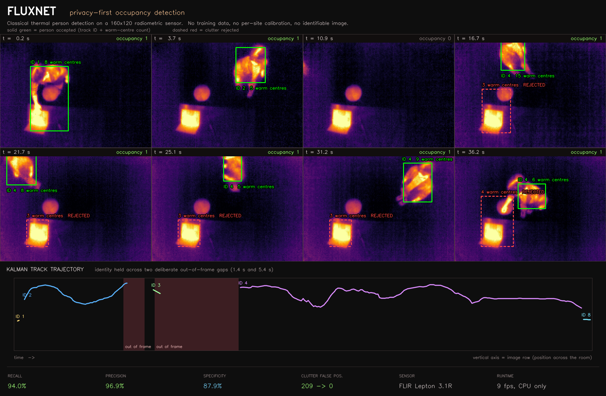

# Occupancy-Detection-Program

**FLUXNET** — privacy-first occupancy detection. A multi-sensor node that counts
people without cameras, microphones, or per-site training.

Sensing is done with a **radiometric thermal camera** (body heat), **mmWave
radar** (motion, micro-motion, absolute range and radial velocity), and a
planned **dToF SPAD depth sensor** (head/shoulder valley separation). No
modality can capture an identifiable image of anyone — privacy is a property of
the physics, not of a policy.



*Live thermal output. The warm square in frame is rejected on every frame
because a body radiates from several places at once and a heat source radiates
from one.*

---

## Status

| Sensor | State | Headline |
|---|---|---|
| **Thermal** | working, trained model deployed | classical **94.0 % recall / 96.9 % precision**; YOLO26n **mAP@50 0.991** |
| **mmWave** | working, headless pipeline | 12 m tracking at 16.7 fps, on-chip tracker, no host DSP |
| **Depth** | not started | ST VL53L8CX / VL53L9CX |
| **Fusion** | designed, not built | radar → thermal image plane, IoU confirmation |

### Thermal

Two detectors. A **classical, untrained** one — threshold above ambient →
morphology → connected components → geometry, where every detection traces to a
temperature and a shape — and a **YOLO26n** trained on labels the classical
detector proposed and a human corrected.

The learned model went from mAP@50 **0.491 → 0.991** between v1 and v2. Not from
a bigger network or more epochs: v1's validation box loss *rose* while training
loss fell, which is a model fitting label noise. The fix was better labels, and
most of [`Thermal/README.md`](Thermal/README.md) is the annotation pipeline that
produced them.

### mmWave

TI IWR6843AOPEVM running TI's *3D People Tracking* demo. The group tracker runs
**on the radar**, so the host decodes a few hundred bytes at ~17 Hz and does no
signal processing — which is why this deploys to a Raspberry Pi unchanged.
Decoding uses TI's own parser, imported from the Radar Toolbox and verified to
have no Qt dependency.

See [`mmWave/README.md`](mmWave/README.md), including a documented firmware
constraint TI does not state anywhere: `fineMotionCfg` requires 48 chirp loops,
not 96.

---

## Repository layout

| Folder | Contents |
|---|---|
| `Thermal/` | FLIR Lepton 3.1R + PureThermal 3 — capture, annotation pipeline, classical + learned detection, tracking |
| `mmWave/` | TI IWR6843AOPEVM — flashing, configuration, TLV decoding, logging |
| `docs/` | project-level figures |
| _(planned)_ `Depth/` | ST VL53L8CX / VL53L9CX multizone depth |
| _(planned)_ `Fusion/` | cross-sensor association, tracking, crossing counts |

## Hardware

| Role | Part |
|---|---|
| Thermal | FLIR Lepton 3.1R (160×120 radiometric, 95° HFOV) + PureThermal 3 |
| Radar | TI IWR6843AOPEVM (60 GHz FMCW, antenna-on-package, ±70° FoV) |
| Depth | ST VL53L8CX (8×8) / VL53L9CX (2.3k zones) |
| Host | Raspberry Pi 5 (target) · macOS (development) |

---

## Design principles

**No per-site training.** Detection must generalise across rooms without
recalibration — the burden that has sunk comparable thermal and CSI systems.
The classical detector needs none by construction. The learned model is trained
once on diverse data and deployed frozen, never fitted per installation.

**Measure, don't assume.** Every processing stage in the thermal detector is
individually toggleable so its contribution can be measured, and the active
configuration is written into every capture manifest so results stay
attributable. Several ideas that sounded good were measured and discarded:
warm-centroid propagation compensation (worse than nothing — p25 IoU 0.231 →
0.183), background subtraction as a detection threshold (deleted 1842 valid
labels, because a person seated at a desk *is* their own background), and a 9 m
radar config with static retention (measurably worse than TI's stock).

**Sensors that fail differently.** A radiator looks like a person to a bolometer
forever, and is invisible to radar. Radar multipath ghosts have no thermal
signature. Requiring spatial agreement between the two kills both classes of
error with one test — which is the argument for fusion, and why it is planned as
cross-sensor IoU rather than a bigger model on either sensor alone.

---

## Quick start

```bash
# thermal — live classical detection
cd Thermal && ./run.sh thermal_detect.py --view any --cohesion 2 --delta 2.5

# thermal — trained model
cd Thermal && ./run.sh live_yolo.py --weights models/v2/best.pt --conf 0.374

# radar — headless tracking
cd mmWave && ./.venv/bin/python ti_track.py --cfg configs/AOP_9m_default.cfg
```

Full setup, including the macOS libuvc recipe the thermal camera requires, is in
each sensor's README.
