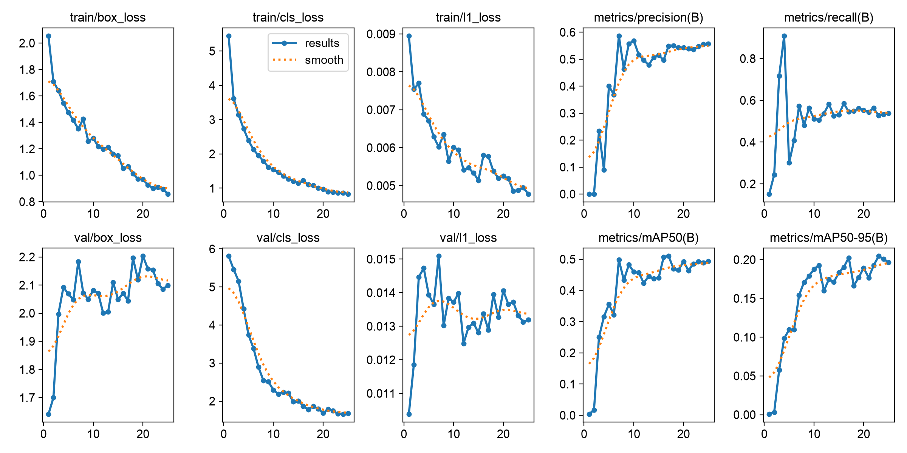
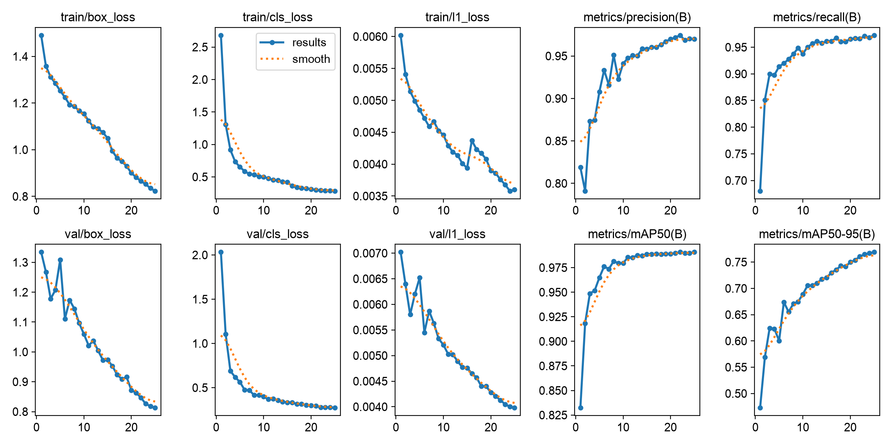
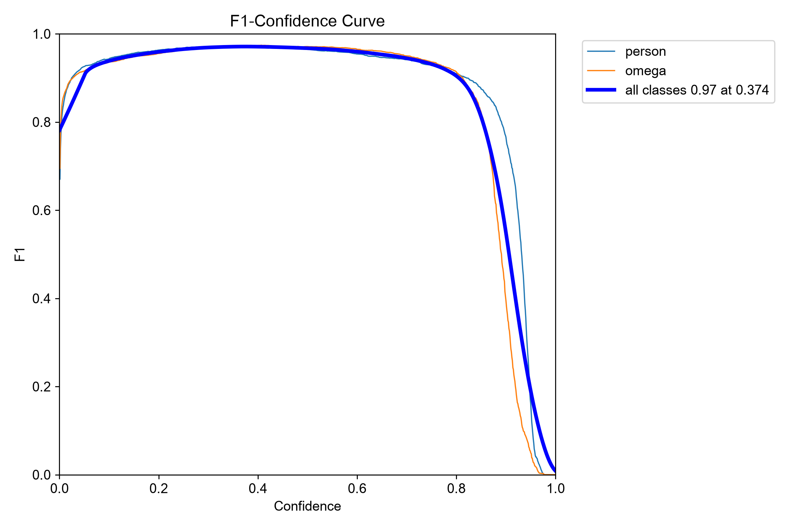
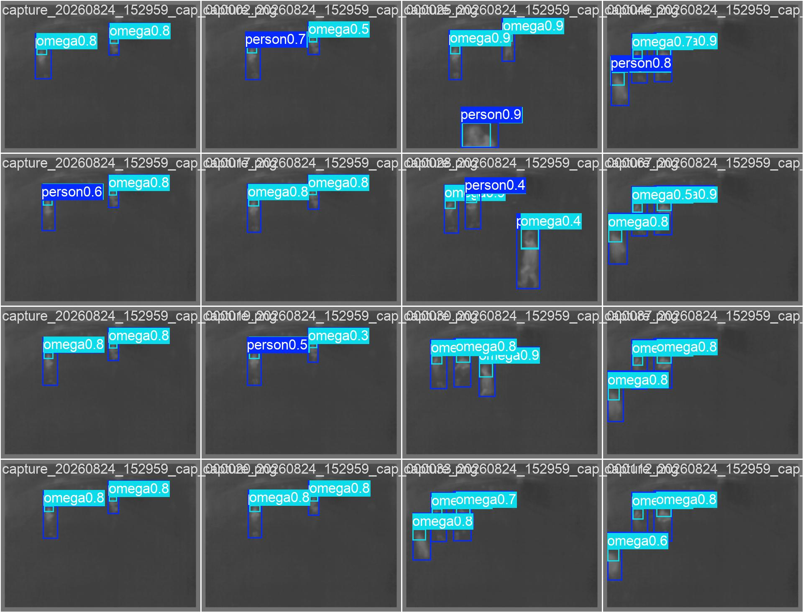
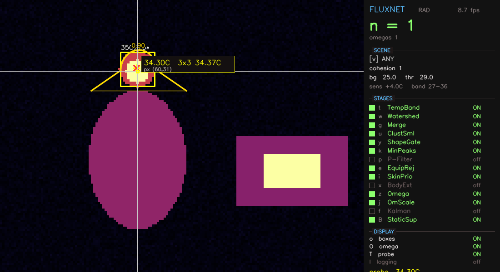
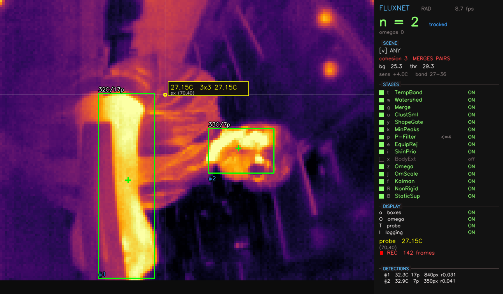
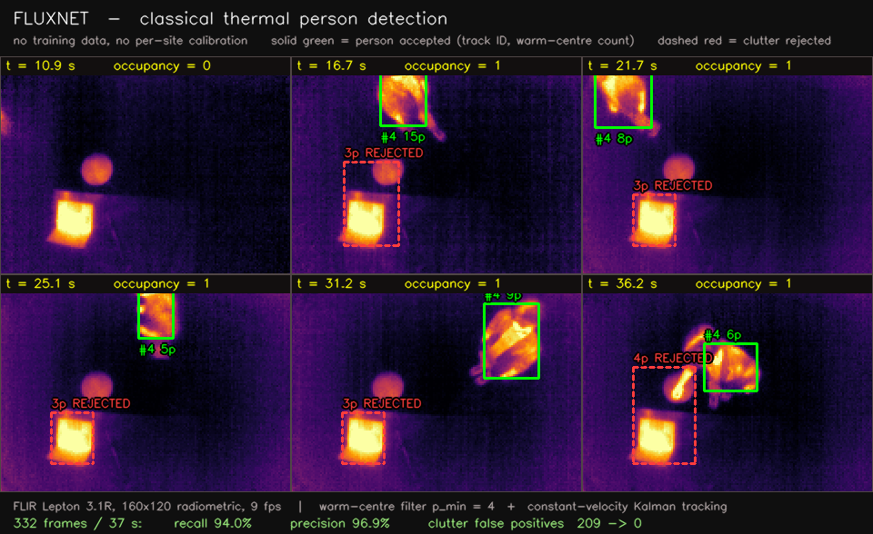
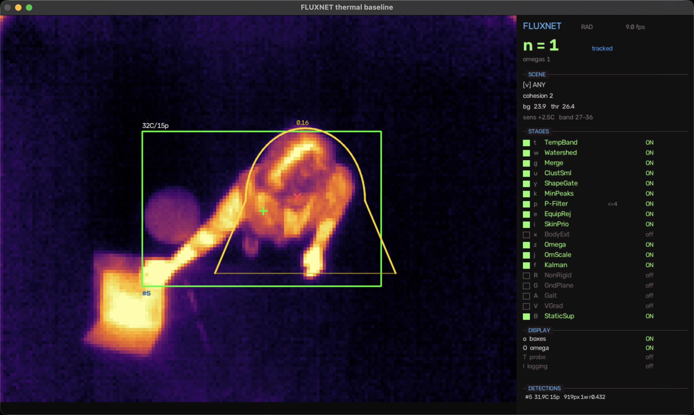

# FLUXNET — thermal detection

FLIR **Lepton 3.1R** (160×120 radiometric, 95° HFOV) on a PureThermal 3.

Two detectors live here, and the second exists because the first ran out of
road — not because a CNN was the goal:

- **`thermal_detect.py`** — a classical, untrained detector. Threshold above
  ambient → morphology → connected components → geometry. Every detection traces
  to a temperature and a shape. Still the reference the learned model must beat.
- **`live_yolo.py` / `integrated_launcher.py`** — a YOLO26n trained on labels the
  classical detector proposed and a human corrected.


*Live output from the classical detector. The warm square in frame is rejected
on every frame because a body radiates from several places at once and a heat
source radiates from one.*

---

## Measured results

**Classical detector**, 332 frames: **94.0 % recall, 96.9 % precision, 87.9 %
specificity**, clutter false positives **209 → 0** against the same run with the
warm-centre filter off. It has no confidence score at all — only binary gates —
which is precisely why it cannot be tuned along a precision/recall curve.

**Learned detector**, held-out validation:

| | v1 | v2 | change |
|---|---|---|---|
| mAP@50, person | 0.491 | **0.991** | — |
| mAP@50, omega | 0.372 | **0.989** | **2.66×** (57× error reduction) |

<table>
<tr><td width="50%"></td>
    <td width="50%"></td></tr>
<tr><td align="center"><b>v1</b> — <code>val/box_loss</code> <i>rises</i> 1.65 → 2.10</td>
    <td align="center"><b>v2</b> — <code>val/box_loss</code> falls 1.33 → 0.81</td></tr>
</table>

The v1 curve is the whole story of why v2 exists. Validation box loss climbing
while training loss falls is a model fitting label noise, and v1's labels were
the classical detector's raw output — boxes drawn around the *thresholded hot
blob*, not around the person. The fix was not a bigger model or more epochs. It
was better labels.



*F1 peaks at **conf 0.374**, which is where `live_yolo.py` and
`integrated_launcher.py` default. Read the curve rather than accepting 0.25.*



*Genuine held-out frames. Green = person, yellow = omega (head and shoulders).*

Live, on the camera: person **0.92 near / 0.89 far**, ~50 ms inference,
**camera-bound at 9 fps** — the Lepton, not the network, is the bottleneck.

---

## Why omega



The omega class (head-and-shoulders, after Xu et al. 2018) is detected
separately from the full body because the head-and-shoulder silhouette survives
occlusion, crouching and clothing variation that destroy a full-body box. In
this dataset it is also the class that improved most, 0.372 → 0.989.

`integrated_launcher.py` uses **omega only** for YOLO detection and hands the
full-body blob to the classical "horizontal best" tracker — see
[`SHAPE_THEORY.md`](SHAPE_THEORY.md) for the shape descriptors behind it.

---

# Tutorial: capture → dataset → trained model → deployment

The whole pipeline, in the order you actually run it. Every step is dry-run by
default where it destroys anything.

### 0. Setup

```bash
python3 -m venv .venv && source .venv/bin/activate
pip install -r requirements.txt
```

**macOS needs libuvc.** Nothing in the macOS camera stack can reach this board —
OpenCV reports *"backend is generally available but can't be used to capture by
index"*, PyAV gives `[Errno 5]` on every device, and Terminal never appears in
Privacy → Camera so it cannot be granted access. The MacBook's own camera opens
fine in all of them, so it is specific to the PureThermal. libuvc over raw USB
is the working path, and it also delivers true radiometric Y16 that
AVFoundation would never have given us:

```bash
pip install cmake
cd ~
curl -LO https://github.com/libusb/libusb/releases/download/v1.0.27/libusb-1.0.27.tar.bz2
tar xf libusb-1.0.27.tar.bz2 && cd libusb-1.0.27
./configure --prefix=/usr/local && make && sudo make install

git clone https://github.com/groupgets/libuvc.git
cd libuvc && mkdir -p build && cd build
cmake .. -DCMAKE_PREFIX_PATH=/usr/local -DCMAKE_POLICY_VERSION_MINIMUM=3.5
make && sudo make install
```

`-DCMAKE_POLICY_VERSION_MINIMUM=3.5` is required because cmake 4.x dropped
support for libuvc's old `cmake_minimum_required`. Run everything through
`./run.sh` — it handles the sudo that libusb needs to claim the interface from
the macOS kernel UVC driver. On Linux / Raspberry Pi none of this applies: V4L2
exposes the board natively including Y16, and a udev rule replaces sudo.

---

### 1. Capture

```bash
./run.sh thermal_detect.py --view any --cohesion 2 --delta 2.5 \
  --kalman --p-filter --p-min 4 --note "two abreast"
```

Press **`c`** to start recording. Every frame is written **four** times:

| folder | contents | regenerable? |
|---|---|---|
| `npy/` | the measurement, absolute °C | **never** — this is the archive |
| `png/` | clean image | yes |
| `labels/` | YOLO boxes from the classical detector | yes |
| `review/` | boxes burned onto the image, for your eyes | yes |

Record scripted scenarios: empty room · one person crossing · two abreast · one
seated and still · warm clutter only. **Record an empty room.** Without it the
false-positive rate — the error that matters for an occupancy sensor — cannot be
measured at all.

### 2. Normalise the machine labels

```bash
python3 normalise_labels.py logs/capture_X            # dry run
python3 normalise_labels.py logs/capture_X --apply
```

The detector boxes the **thresholded hot blob**; a human boxes the **person they
can see**, including cooler clothing the threshold missed. Two annotators, two
conventions, same object. Measured: the classical box is 0.90× the width and
0.91× the height of the warm body, covering 81 % of its area — and in **15 % of
cases less than half of it**, which is contradictory supervision rather than
mere noise. This converts the machine to the human convention automatically,
with two guards: warm pixels are assigned to their *nearest* hot blob so a box
grows onto its own clothing and stops at its neighbour, and growth beyond
`--max-growth` is refused rather than allowed to run away across a warm floor.
Omega boxes are left alone.

### 3. Triage — decide what needs a human, and group it

```bash
python3 triage.py logs/capture_X                  # asks for the cut-off
python3 triage.py logs/capture_X --max-boxes 1    # unattended
```

**Do not delete frames the detector got wrong.** That throws away exactly the
examples a model most needs, and it biases what survives: false positives are
visible in review and get deleted, misses look identical to an empty frame and
quietly stay. The surviving labels then under-count, punishing any model that
detects better than its teacher.

At ~8.7 fps consecutive frames are near-identical, so a box drawn on one is
valid for its neighbours. Clusters are built **sequentially in time**, so
propagation never jumps a cut, and a person who moves breaks the cluster —
which is what we want. Measured on a 4190-frame capture:

| `--sim` | clusters | you annotate | leverage | drift p90 |
|---|---|---|---|---|
| 0.30 | 145 | 84 | 18.1× | 27.9 px |
| 0.20 | 231 | 108 | 14.1× | 14.4 px |
| 0.15 | 344 | 146 | 10.4× | 8.9 px |
| **0.10** | 555 | 221 | 6.9× | 7.2 px |

### 4. Annotate

```bash
python3 annotate.py logs/capture_X --compensate
```

One representative frame per cluster. Click two corners, press **`1`** for
person or **`2`** for omega, **Enter** for next, **`u`** to undo, **`x`** to
delete, right-click to remove a box.

**Your work goes to `labels_human/`, never `labels/`.** The machine's labels
stay exactly as written, so the two annotators can never silently blend and any
frame's provenance is readable from which folder holds its label.

**`--compensate` matters.** A cluster is near-identical, not identical, and the
box is copied verbatim to every frame in it. Measured over 3726 labelled frames:
the frame you drew scores median IoU 0.396, propagated frames 0.361, and **45
boxes land on empty space** — none on a frame anyone drew, 60 % of them past
frame 15 of a long cluster. `--compensate` shifts each propagated box by however
far its own subject moved, using template matching (a warm-centroid version was
tried and measured *worse*: p25 IoU 0.231 → 0.183).

Already annotated without it? Don't redo the work:

```bash
python3 recompensate.py logs/capture_X            # dry run
python3 recompensate.py logs/capture_X --apply
```

### 5. Regenerate the reviews

```bash
python3 refresh_review.py logs/capture_X
```

`review/` is written once at capture time with the *machine's* boxes burned in.
It does not change when you annotate — so a visual QA pass afterwards would be
checking stale pictures without knowing it. This rebuilds it from `npy/` plus
whichever label is authoritative, and marks provenance:

- **GOLD** — solid box, `H` tag, from `labels_human/`
- **silver** — dashed box, `m` tag, still the machine's

### 6. Post-review, worst first

```bash
python3 review.py logs/capture_X                 # clusters, worst IoU first
python3 review.py logs/capture_X --min-score 0.20
python3 review.py logs/capture_X --frames --skip-drawn
```

**Enter** approves, **`x`** deletes, **`b`** goes back.

Flipping through 4000 frames in filename order spends attention uniformly on a
problem that is not uniform. Of 431 annotated clusters in one capture:

```
 87  a person-sized warm blob with no box on it   (MISS)
  7  a box touching no warm pixels at all         (IoU 0.00)
 27  a box scoring below 0.20
---
121  worth opening (28%)   |   310 the score can find no fault with
```

Worst-first turns a five-hour census into a forty-minute pass. Cluster mode
shows the **worst-scoring** frame in each cluster — if a box survives its
hardest frame it survives the rest.

Then carry out the deletions, reversibly:

```bash
python3 apply_deletions.py logs/capture_X            # dry run
python3 apply_deletions.py logs/capture_X --apply    # → labels_human_rejected/
python3 apply_deletions.py logs/capture_X --undo
```

Rejected labels are **moved**, not deleted, and the `.npy` measurements are
never touched. On the reference capture: **2971 approved, 324 deleted**.

### 7. Prune

```bash
python3 prune.py logs/capture_X            # report only
python3 prune.py logs/capture_X --apply
```

Whatever you deleted from `review/` in Finder is removed from `npy/`, `png/` and
`labels/` too. The indirection is the point: deleting from `review/` is safe
because `review/` is disposable; deleting from `npy/` would destroy measurements
you cannot recapture.

### 8. Build the dataset

```bash
python3 make_dataset.py logs/capture_* --out datasets/v2 \
  --train-source human --val-fraction 0.2 --split-by frame --seed 0
```

Not `png/` directly. The live palette is percentile-stretched **per frame**, so
the same scene encodes to different pixel values depending on what else is in
view — a network trained on that learns a person's brightness is arbitrary.
Here every frame goes through the **same fixed temperature span**, so a pixel
value means one temperature across the whole dataset. That is the entire
advantage of a radiometric sensor over a webcam, and a per-frame stretch throws
it away. Output is 8-bit 3-channel PNG so COCO-pretrained weights transfer.

**Validation is human-only, by construction.** The split is taken over gold
labels; silver can only ever join train. Noisy labels in *training* are weak
supervision and the model averages over them; noisy labels in *validation*
corrupt the number you report and there is no way to detect it afterwards.

**Prefer holding out whole sessions** (`--val-sessions 1,2,3`) once you have
several. Random frame splits leak: consecutive frames are near-duplicates, so
the model is validated on frames it effectively trained on. `--split-by cluster`
quantifies that leakage. A single 203-frame capture sounds respectable until you
cluster it — 12 clusters over 23 seconds is ~12 independent moments, and one bad
cluster swings the score by 8 %.

### 9. Train

```bash
yolo detect train model=yolo26n.pt data=datasets/v2/data.yaml \
  imgsz=160 epochs=25 batch=16 device=mps
```

`device=cuda` on a PC, `device=mps` on Apple Silicon. `imgsz=160` matches the
Lepton's native width — upscaling invents detail the sensor never measured.

Watch **`val/box_loss`**, not mAP. If it rises while training loss falls, the
labels are the problem and no amount of training fixes it. That is exactly what
v1 did.

### 10. Deploy

**YOLO only** — the clean baseline:

```bash
./run.sh live_yolo.py --weights models/v2/best.pt --conf 0.374 --scale 6
```

**Integrated tracking** — YOLO finds people, Kalman follows them, YOLO
re-detects on loss:

```bash
./run.sh integrated_launcher.py --weights models/v2/best.pt
./run.sh integrated_launcher.py --weights models/v2/best.pt --mode yolo
```



Every parameter is live-tunable from the sidebar, and `--mode` switches between
integrated tracking and pure YOLO detection. Track births are logged with the
geometry that caused them, so churn can be diagnosed rather than guessed at:

```bash
python3 track_report.py logs/integrated_*_events.csv
```

It classifies every new id as `genuine`, `duplicate`, `gate_miss`, `contested`
or `returning` — four different failures needing four different fixes. The first
version of that report called duplicates "gate misses" and recommended a
Mahalanobis gate that would have changed nothing.

**Occlusion rule**, arrived at over three rounds of correction and worth stating
because it is counter-intuitive: leaving the **frame boundary** in any direction
is an exit, full stop. Only losses in the *interior* use direction — downward is
hidden (crouching behind furniture), sideways is an exit (a wall), unclear is
hidden.

---

## The classical detector

Still the baseline, still useful, and the source of every proposal the
annotation pipeline starts from.



*Run 2 configuration on real frames — the best measured classical result:
94.0 % recall, 96.9 % precision, and clutter false positives 209 → 0.*



```bash
./run.sh thermal_detect.py --view any --cohesion 2 --delta 2.5 \
  --kalman --p-filter --p-min 4
```

### How it works

1. **Radiometric capture** — 16-bit Y16/TLinear, so each pixel is an absolute
   temperature rather than an auto-gain brightness.
2. **Ambient estimate** — median pixel; people are a minority of the frame.
3. **Temperature band** — `T > ambient + delta` **and** `27 ≤ T ≤ 36 °C`:

   | Source | Typical °C | In band? |
   |---|---|---|
   | Exposed skin | 30 – 35 | ✅ |
   | Clothed torso | 27 – 32 | ✅ |
   | Sun-warmed surface | ~26 | ❌ below |
   | Laptop | ~41 | ❌ above |
   | Lamp | ~52 | ❌ above |
   | Radiator | ~60 | ❌ above |

   Because clutter is rejected by *temperature*, minimum blob area can be small
   (6 px) — that is what gives range. In a warm room the relative threshold is
   capped at `tmax − 2` so the band cannot silently collapse to zero detections.
4. **Morphology**, then **watershed split** — two people standing close merge
   into one component and no filter can undo that; the blob must be cut at the
   distance-transform valley.
5. **Mounting mode** — `vertical` (ceiling), `horizontal` (wall), `any`.
   Switch live with `v` or `1`/`2`/`3`; the mode is recorded in the CSV.
6. **Fragment merge** — horizontal: vertical splits merge, horizontal ones
   don't (people stand side by side, bodies stack vertically). Vertical: the
   axis carries no information, so the physical limit is used instead — splits
   closer than `--min-sep` merge.

### Stage toggles — the ablation panel

Every filter can be switched on and off live, so a stage's contribution is
*measured* rather than assumed. The active configuration is written into every
capture manifest, so results stay attributable.

| Key | Stage | Default | What it does |
|---|---|---|---|
| `t` | TempBand | ON | absolute plausibility band |
| `w` | Watershed | ON | cuts touching bodies |
| `g` | Merge | ON | rejoins fragments split by cool clothing |
| `y` | ShapeGate | ON | aspect / extent / rect-fill envelope |
| `k` | MinPeaks | ON | a body is multi-peaked, a heater is not |
| `p` | P-Filter | OFF | drops blobs with ≤ `--p-min` peaks |
| `e` | EquipRej | ON | rigid-surround context test (the laptop rejector) |
| `i` | SkinPrio | ON | skin-band blobs bypass later gates |
| `z` | Omega | ON | head-and-shoulder Ω detection |
| `f` | Kalman | OFF | temporal tracking |
| `B` | StaticSup | ON | suppresses unmoving warm objects |

To find out which stage is carrying a scene: turn everything off and add one
back at a time. **Cohesion is not monotonic** — a larger CLOSE kernel changes
blob topology, which changes where watershed cuts, so raising it can *add* a
detection. Tune by watching the mask view (`r`).

| Scenario | Settings |
|---|---|
| Vertical, single occupant | `--view vertical --cohesion 4` |
| Vertical, multiple occupants | `--view vertical --cohesion 2` |
| Horizontal, any occupancy | `--view horizontal --cohesion 1` |
| Long range | `--min-area 4 --delta 2.5` |

### Diagnostics

| Script | Purpose |
|---|---|
| `diagnose.py` | what each video device delivers, in both capture modes |
| `backend_test.py` | every backend × format combination |
| `lepton_libuvc.py` | standalone libuvc capture test |

---

## Known limits — these are the fusion arguments

- **Warm clutter** — lamps, laptops, radiators. Radar disambiguates by motion
  and breathing micro-motion; a radiator has neither. This is the strongest
  argument for cross-sensor IoU confirmation, because the two sensors'
  false positives are uncorrelated.
- **Touching people** — two adjacent bodies merge into one blob. Depth (head
  peaks, shoulder valleys) separates them.
- **Glass** — LWIR does not pass through glass or eyewear. A glazed door is a
  wall to this sensor.
- **FFC** — the shutter recalibrates periodically; the image freezes ~1 s.
  Expected, not a fault. Kalman coasting exists partly to survive it.
- **Seated stillness** — a motionless person is the hardest case, and the one
  the radar's static retention is meant to cover.

## Planned: thermal ↔ radar fusion

Project radar tracks into this camera's image plane and compute IoU against the
YOLO omega box, then feed the radar's **measured** range and radial velocity
into the Kalman filter instead of differencing noisy positions.

Geometry, worked out but not yet built: `fx = 80/tan(47.5°) ≈ 73 px` at 95°
HFOV, so 0.59°/px and a 1.7 m person is ~25 px tall at 5 m. IoU tolerates 2–3 px
of misalignment, which sets a calibration budget of roughly 1.5–2° total. At 95°
the lens needs real distortion coefficients — a plain pinhole model spends the
entire budget on barrel distortion before any other error. See
[`../mmWave/README.md`](../mmWave/README.md).
