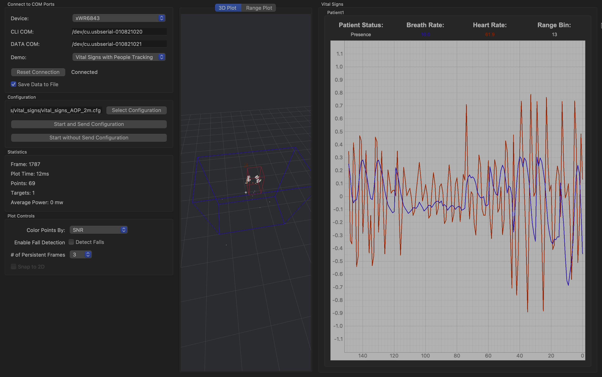

# FLUXNET — mmWave radar

TI **IWR6843AOPEVM** (60 GHz FMCW, antenna-on-package) running TI's *3D People
Tracking* demo. The group tracker runs **on the radar**, so the host decodes a
few hundred bytes at ~17 Hz and does no signal processing at all — which is why
this deploys to a Raspberry Pi without a second thought.

No camera, no microphone. The radar cannot form an identifiable image of anyone;
privacy is a property of the physics rather than of a policy.

---

## What is here

| File | Purpose |
|---|---|
| `ti_track.py` | **Main tool.** Configure the sensor, decode frames with TI's own parser, print/save tracks. Headless. |
| `adaptive.py` | Switch between a close-range and a long-range config at runtime, based on where targets actually are |
| `gui_adaptive.py` | TI's Industrial Visualizer with that switching attached — no edits to TI's tree |
| `stream.py` | Serial layer — config sender, reply classification, reset. Also a standalone reader with its own parser (superseded; see below). |
| `find_ports.py` | Work out which half of the CP2105 is CLI and which is DATA |
| `power_cycle.py` | Reset the sensor over the CLI instead of unplugging it |
| `cli_probe.py` | Minimal bisection tool: is the board silent, or is our code wrong? |
| `viz.py` | Early hand-built 3D viewer. **Superseded** by TI's Industrial Visualizer. |
| `configs/` | TI's stock chirp profiles plus two local hybrids |

---

## Quick start

```bash
python3 -m venv .venv
./.venv/bin/pip install pyserial numpy

./.venv/bin/python ti_track.py --self-test        # no hardware needed
./.venv/bin/python find_ports.py                  # which port is which
./.venv/bin/python ti_track.py --cfg configs/AOP_9m_default.cfg --seconds 30
```

`ti_track.py` locates TI's parser automatically inside a `radar_toolbox_*`
install under `~/Developer`, `~/Downloads`, `~/ti` or `/opt/ti`. Point it
elsewhere with `--ti-common <path>`.

Typical output:

```
configured; sensor started
reading /dev/cu.usbserial-010821021 at 921600 — Ctrl-C to stop
frame    2004  people 1 [1        ]  nearest  0.8 m  points  10 (8 assigned)   16.7 fps

frames        2003   (16.7 fps)
peak people   1   (1 distinct ids: [0])
occupied      98% of frames
```

---

## Firmware

Flash **3D People Tracking**, standard lab (not Low Power):

```
radar_toolbox_*/source/ti/examples/Industrial_and_Personal_Electronics/
  People_Tracking/3D_People_Tracking/prebuilt_binaries/3D_people_track_6843_demo.bin
```

**625,668 bytes.** The Low Power lab ships a binary with the *identical
filename* at 637,380 bytes — check the size, not the name. Neither carries
`aop` in its name because the demo is device-agnostic; the antenna geometry
comes from the config's `antGeometry0` / `antGeometry1` / `antPhaseRot` lines.

Flash with UniFlash over the **Enhanced** COM port, SOP jumpers in flash mode,
then SOP back to functional and **power-cycle** — SOP is sampled at reset.

### Vital Signs with People Tracking

A separate lab, and unlike People Tracking it ships a **device-specific** build:

```
Vital_Signs/Vital_Signs_With_People_Tracking/prebuilt_binaries/
  vital_signs_tracking_6843AOP_demo.bin        # 633,988 bytes — take the AOP one
```

Demonstrated working (screenshot below): breathing and heart rate recovered
from chest displacement, on top of the normal tracker. Constraints from TI's
user guide and its configs, all of which matter:

- **One person.** `trackingCfg 1 2 800 **1** 46 96 90` — `maxNumTracks` is 1,
  against 30 in the People Tracking configs. This is a single-subject monitor,
  not an occupancy counter.
- **20 seconds of stillness**, seated or lying, sensor pointed at the chest,
  **≤ 5 m**. Walking around produces nothing.
- Runs at ~11 Hz (`frameCfg ... 90.00`) rather than 17.
- `VSRangeIdxCfg 0 21` — the leading `0` disables fixed-range mode, so vitals
  follow the tracker's position rather than a hard-coded bin. The `21` is inert.
- The 2 m and 6 m configs differ **only** in their three boundary boxes;
  identical chirp profile. "Range mode" here is a tracker box, not an RF
  setting, and the profile's unambiguous range is ~8.1 m
  (`c·Fs / 2·S` with `Fs = 10785` ksps, `S = 200` MHz/µs).

Worth keeping in view for occupancy even though it counts only one person:
**breathing is the ultimate static-presence signal.** Static retention is a
heuristic patch on the motionless-occupant problem; chest displacement is direct
physical evidence that a room is occupied, and someone asleep for six hours
still breathes.

Not usable on this board: the *Long Range People Detection* lab (50 m / 100 m).
TI's guide specifies the IWR6843 **ISK**, its configs carry no `antGeometry`
lines, and the beamforming variants need the MMWAVEICBOOST carrier. The AOP
trades antenna gain for its wide field of view; 12 m is its practical ceiling
here.

---

## Configs

| File | Range | Static retention | Notes |
|---|---|---|---|
| `AOP_6m_default.cfg` | 8 m | no | TI stock |
| `AOP_6m_staticRetention.cfg` | 8 m | **yes** | TI stock |
| `AOP_9m_default.cfg` | 12 m | no | TI stock — **currently the best measured** |
| `AOP_9m_sensitive.cfg` | 12 m | no | TI stock, lower CFAR thresholds |
| `AOP_9m_staticRetention.cfg` | 12 m | yes | **local hybrid** — see below |
| `AOP_9m_*_desk.cfg` | 12 m | — | local test variants, `staticBoundaryBox` near edge 2 m → 0.5 m |
| `IWR6843AOP_7m_staticRetention_lp.cfg` | 8 m | yes | Low Power lab — wrong lab for the current firmware |

TI ships **range and static retention as mutually exclusive**: the 9 m configs
drop `fineMotionCfg`, so a person who sits still stops being tracked. That is
the failure mode that matters most for occupancy, and the one TI's own support
engineers tell people to fix by enabling static retention.

### The hybrid, and its honest result

`AOP_9m_staticRetention.cfg` adds `fineMotionCfg` to the 9 m profile. Two
findings came out of building it, both worth keeping:

**`fineMotionCfg` requires 48 chirp loops, not 96.** Adding the line alone
produced `sensorStart` → `Error -1`, or a hang after `Init Calibration Status`.
The clue is in TI's own tree: of the fourteen shipped configs that enable fine
motion, **every one** runs 48 chirp loops (or 112 with a 120 ms frame). None
uses 96. Undocumented, visible only as a pattern.

**And with that fixed, the hybrid still loses.** 120 s seated, same chair:

| | 9 m + static retention | 9 m stock |
|---|---|---|
| occupied | 90.7 % | **98.5 %** |
| longest continuous hold | 109.1 s | **118.0 s** |
| longest dropout | 11.2 s | **1.7 s** |

Halving the chirp loops costs ~3 dB of coherent integration and fine motion did
not buy it back. **Use `AOP_9m_default.cfg`.**

That test also did not measure what it set out to: median points per frame was
**0 for both configs**, so neither was detecting the subject — the tracker was
coasting on its state machine. TI's CLI source names the fields:

```
stateParam <det2act> <det2free> <act2free> <stat2free> <exit2free> <sleep2free>
           3         3          12         500         5          6000
```

`stat2free = 500` frames ≈ 30 s and `sleep2free = 6000` ≈ 6 minutes, identical
in both configs. **Track survival is therefore the wrong metric for static
retention**; the right one is points per frame on a stationary person. A proper
test needs the sensor mounted as the config claims — `sensorPosition 2 0 15`,
2 m up and tilted 15° down — with the subject 3–5 m out.

---

## Adaptive config switching

No single profile is good at both close and long range, so `adaptive.py` runs
the close-range one by default and switches when the scene calls for it:

```
CLOSE  AOP_6m_staticRetention   holds a person who sits still (99% occupied at desk range)
FAR    AOP_9m_sensitive         12 m box, lower CFAR thresholds, finds weak distant targets

CLOSE -> FAR   nearest target >= --near-min  AND  >= --far-count targets beyond --far-enter
FAR -> CLOSE   nothing beyond --far-exit, or anything closer than --near-min
```

```bash
python adaptive.py --replay logs/session.jsonl     # tune on recorded data first
python adaptive.py --dry-run --save logs/dry.jsonl # decide and log, never switch
python adaptive.py --save logs/adaptive.jsonl      # live
python gui_adaptive.py --dry-run                   # same rule, inside TI's GUI
```

**A switch costs a measured ~1.8 s blackout and resets every track id.** Both
are inherent to reconfiguring, and both are why the rule is debounced hard:
separate enter/exit thresholds (6.0 / 5.0 m), the condition must hold 3 s
continuously, and a 30 s minimum dwell. A test that hammers the threshold once
a second for a minute produces zero switches; a genuine sustained crowd
switches exactly once.

The id reset is not a wrinkle to paper over. Every switch writes
`{"event": "switch", ..., "note": "all radar track ids reset here"}` into the
log, because identity has to live in the **fusion** layer — carried through the
blackout by the thermal track, then re-associated by position when the radar
comes back. Radar is poor at motionless people and thermal is excellent at
them, so this division of labour is the right way round.

`--near-min` exists because the 9 m profile's `staticBoundaryBox` starts at 2 m:
measured at 0.65 m, the 9 m configs reported 0–15 % occupancy where the 6 m
config reported 99 %. Switching to FAR while someone is that close trades a
tracked person for a distant one.

`gui_adaptive.py` wraps `Core.updateGraph` from outside rather than patching
TI's source, so a toolbox reinstall cannot silently undo it. The switch is
`parseTimer.stop()` → `parseCfg(path)` → `sendCfg()` — `parseCfg` rather than
`selectCfg` because the latter opens a file dialog, and because `parseCfg` also
refreshes the boundary-box drawing so the 3D view redraws the new room.

---

## Operating notes that cost real time

**A failed `sensorStart` wedges the board.** The CLI stops answering and stays
dead until USB power is removed. Nearly every mysterious silence during
development was the aftermath of a previous failed test, not a new fault.
`ti_track.py` now issues `resetDevice` before every config send, which removes
the problem for everything except a genuine wedge.

**`sensorStart` can take many seconds** — it runs boot calibration and prints
`Debug: Init Calibration Status = 0xffe` before `Done`. A short read timeout is
indistinguishable from a rejected command unless "echoed but never answered" is
a separate category from "answered with an error". `stream.py` treats them
differently for exactly this reason.

**The boot banner is the only proof of a reset.** A responding prompt proves
nothing, because a board that never reset also responds:

```
***********************************
IWR68xx Indoor people counting demo
```

**DTR and RTS do nothing on this EVM.** Measured with
`power_cycle.py --identify`: DTR low, RTS low and both low each left the CLI
answering and none produced a boot banner. They are neither NRST nor flow
control here. (An earlier version of these notes claimed otherwise; it was
wrong.)

**The ports enumerating proves nothing about the radar.** The CP2105 is a
separate chip powered from USB and appears in `/dev` whether or not the
IWR6843 has booted.

**The two CP2105 halves are not interchangeable** — Enhanced = CLI at 115200,
Standard = DATA at 921600. On macOS both report the same description, so TI's
auto-detect cannot fire and the paths must be typed in by hand.

---

## Frame format

Decoding is done by **TI's own parser** (`parseFrame.py`, `parseTLVs.py`,
`tlv_defines.py` from `Applications_Visualizer/common`), imported directly from
the Radar Toolbox. It has no Qt dependency — verified by importing it in an
environment with no PySide2 present — so it runs headless on the Pi.

`stream.py` contains an independent parser that derived the same layout by
walking every plausible header length and TLV convention until one landed
exactly on the end of the packet. It agreed with TI (40-byte header, TLV length
excluding its own 8-byte header, target structs `I27f` and `I2f`), which was a
useful confirmation, but reverse engineering has a shelf life and TI's version
is authoritative. It is kept for reference only.

TLVs this firmware emits:

| id | contents |
|---|---|
| 1010 | target list — id, position, velocity, acceleration, covariance, confidence |
| 1011 | per-point target index (253–255 = noise / unassigned) |
| 1012 | per-target height (min z, max z) |
| 1020 | compressed spherical point cloud |
| 1021 | presence indication |

Occupancy comes from the target list. `trackData` is (N,16); TI does **not**
fold the point-to-track assignment into the point cloud — it lands in a
separate `trackIndexes` array while `pointCloud` column 6 stays at its 255
initialiser.

---

## TI's Industrial Visualizer

TI's own GUI is the reference implementation and worth having as an oracle.
It runs natively on Apple Silicon via conda-forge:



*TI's Industrial Visualizer running natively on Apple Silicon — device
`xWR6843`, ports typed as `/dev/cu.usbserial-*` paths because TI's auto-detect
matches Windows driver descriptions and cannot fire on macOS. This is the
**Vital Signs with People Tracking** lab: one target tracked in the 3D plot at
left, and at right the chest-displacement waveform decomposed into breathing
(blue, **10 breaths/min**) and heartbeat (red, **61.9 bpm**) from range bin 13.
The radar measures sub-millimetre skin movement by phase, not by range —
at 60 GHz, λ ≈ 5 mm, so a 0.5 mm heartbeat displacement is ~72° of phase.*

```bash
brew install --cask miniforge
conda create -n tiviz -c conda-forge python=3.10 pyside2 pyqtgraph pyopengl pyserial numpy -y
conda activate tiviz
pip install json-fix
cd <toolbox>/tools/visualizers/Applications_Visualizer/Industrial_Visualizer
python gui_main.py
```

`pip install -r requirements.txt` will **not** work — TI pins `PySide2==5.15.2.1`
and `numpy==1.19.4`, neither of which has an arm64 wheel. conda-forge ships
PySide2 5.15.15 for osx-arm64.

Three things to know:

- **Set Baud → Output → 921600.** `Baud_Rates_Manager.py` defaults it to 115200
  while the sensor streams at 921600, which produces an empty window and a
  flood of `read timed out`.
- **Click Connect before Send Config**, or you get
  `'UARTParser' object has no attribute 'cliCom'`.
- **`gui_core.py:333` has a bug.** `QMessageBox.critical()` is a static
  convenience that shows the dialog and returns the clicked button; TI then
  calls `.exec_()` on that button. The error path throws `AttributeError`
  instead of reporting the error, on every platform. Deleting that one line
  fixes it.

Run it from a writable directory — `cached_data.py` writes a `cache` file into
the working directory and fails with `WinError 5` under Program Files.

---

## Status

Working: flashing, port identification, configuration with retry and reply
classification, frame decoding via TI's parser, JSONL logging, scriptable
reset, TI's visualizer on macOS.

Not yet done: mounting at the geometry the configs assume; a static-retention
test measured on points per frame rather than track survival; projection of
radar tracks into the thermal image plane for cross-sensor IoU
(see [`../Thermal/README.md`](../Thermal/README.md)); deployment to the Pi.
